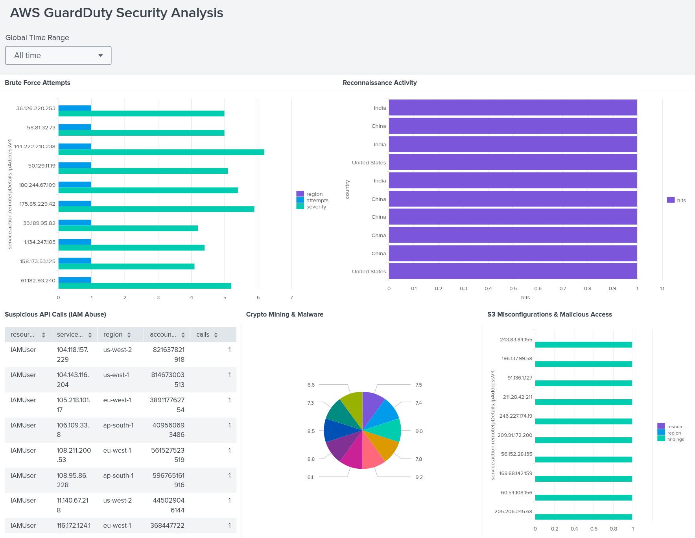

# AWS-GuardDuty-Log-Analysis-using-Splunk
This project provides hands-on experience with Amazon GuardDuty findings using a realistic dataset of 2000 JSON entries. GuardDuty does not log all traffic, instead it generates findings when suspicious or malicious activity is detected.

## Objective
* Ingest GuardDuty findings (JSON logs) into Splunk.
* Detect brute force, port scanning, API misuse, crypto mining, and S3 misconfigurations.
* Practice querying nested JSON fields with spath for SOC-style analysis.

## Preparation
* Splunk Web → Settings → Add Data → Upload
* File: ```guardduty_findings.json```
* sourcetype: ```_json```
* Index: ```guardduty_lab```
* Validate: ```index=guardduty_lab | head 5```

## Background
## What is GuardDuty?
Amazon GuardDuty is a threat detection service in AWS. It continuously monitors AWS accounts, workloads, and data for malicious activity, anomalies, and unauthorized behavior — without requiring infrastructure to manage.

## How it Works
GuardDuty analyzes:

* VPC Flow Logs → Network activity
* CloudTrail Logs → API activity
* DNS Logs → Domain queries
It uses machine learning, threat intelligence feeds, and anomaly detection to surface suspicious findings (JSON alerts).

### Example Findings (Reference)

| Finding Type | Category | Description | Severity |
|--------------|----------|-------------|---------|
| UnauthorizedAccess:EC2/SSHBruteForce | Unauthorized Access | EC2 instance targeted with repeated SSH brute force attempts. | Medium |
| Recon:EC2/Portscan | Reconnaissance | External IP scanning EC2 instance for open ports. | Low |
| IAMUser/MaliciousIPCaller.Custom | Suspicious API | IAM user making API calls from a malicious IP. | Medium |
| CryptoCurrency:EC2/BitcoinTool.B!DNS | Malware / Crypto | EC2 instance querying Bitcoin mining pools. | High |
| S3/BucketAnonymousAccessGranted | Misconfiguration | S3 bucket publicly accessible to anonymous users. | Medium |

## Step by Step Guide
## Task#1 — Brute Force Attempts (EC2 & IAM Console)
EC2 brute force (SSHBruteForce) or IAM login brute force attempts.
```spl
index=guardduty_lab (type="UnauthorizedAccess:EC2/SSHBruteForce" OR type="UnauthorizedAccess:IAMUser/ConsoleLoginBruteForce")
| stats count AS attempts by resource.instanceDetails.instanceId, service.action.remoteIpDetails.ipAddressV4, region, severity
| sort -attempts
```
Here
* ```type```pinpoints brute force categories.
* ```ipAddressV4``` highlights attacker IPs.
* ```severity``` helps SOC triage critical sources.
  
## Task#2 — Reconnaissance (Port Probes & Scans)
Reconnaissance attempts via port scans or probes.
```spl
index=guardduty_lab (type="Recon:EC2/Portscan" OR type="Recon:EC2/PortProbeUnprotectedPort")
| stats count AS hits by resource.instanceDetails.instanceId, service.action.remoteIpDetails.ipAddressV4, service.action.remoteIpDetails.country
| sort -hits
```
Here
* ```type``` indicates reconnaissance.
* ```country``` shows attacker geolocation.
* Repeated hits from the same IP = ongoing recon.

## Task#3 — Suspicious API Calls (IAM Abuse)
IAM users making suspicious or malicious API calls.
```spl
index=guardduty_lab (type="IAMUser/MaliciousIPCaller.Custom" OR type="IAMUser/UnauthorizedAccess") | stats count AS calls by resource.resourceType, service.action.remoteIpDetails.ipAddressV4, region, accountId | sort -calls
```
Here
* ```accountId``` shows which AWS account was targeted.
* ```resourceType``` identifies IAM users.
* Malicious API calls often precede privilege escalation.

## Task#4 — Crypto Mining & Malware
EC2 instances communicating with crypto pools or malware C2.
```spl
index=guardduty_lab (type="CryptoCurrency:EC2/BitcoinTool.B!DNS" OR type="Trojan:EC2/DNSDataExfiltration" OR type="Backdoor:EC2/C&CActivity.B")
| stats count AS detections by resource.instanceDetails.instanceId, service.action.remoteIpDetails.ipAddressV4, severity
| sort -detections
```
Here
* ```BitcoinTool.B!DNS``` = crypto mining pools.
* ```DNSDataExfiltration``` = malware exfil.
* ```C&CActivity.B``` = active command-and-control traffic.

## Task#5 — S3 Misconfigurations & Malicious Access
Detect risky S3 bucket findings.
```spl
index=guardduty_lab (type="S3/MaliciousIPCaller" OR type="S3/BucketAnonymousAccessGranted")
| stats count AS findings by resource.resourceType, resource.instanceDetails.instanceId, service.action.remoteIpDetails.ipAddressV4, region
| sort -findings
```
Here
* BucketAnonymousAccessGranted highlights publicly accessible buckets.
* MaliciousIPCaller shows unauthorized S3 activity from flagged IPs.

## Conclusion
By the end of this lab, you will have analyzed GuardDuty findings across different categories, understood how to triage threats, and simulated how SOC teams handle GuardDuty alerts in real environments. 


